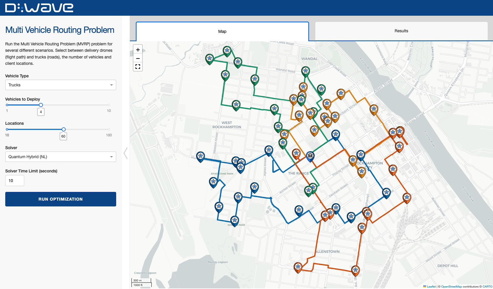

[](https://codespaces.new/dwave-examples/mvrp?quickstart=1)

# Multi Vehicle Routing Problem

Run the Multi Vehicle Routing Problem (MVRP) problem for several different scenarios. Select between
delivery drones (flight path) and trucks (roads), the number of vehicles and client locations.



## Usage

To run, install the requirements

```bash
pip install -r requirements.txt
```

and run the Dash application

```bash
python app.py
```

A browser should open running the web app.

Configuration options can be found in the [app_configs.py](app_configs.py) file.

## Problem Description

The multi-vehicle routing problem is to deliver a set of resources to a set of
predetermined locations using a limited number of vehicles, all of which start and finish at a
single depot location.

This problem can be seen as a generalized traveling salespersons problem (TSP) where each vehicle
must traverse a local network of locations in the most effective way, while also optimizing 
the distribution of sets of locations among the vehicles.

In this demo a single central depot location is determined by choosing an address (can be set in
[app_configs.py](app_configs.py)), after which a number of locations are placed randomly within a
specified radius of the depot. The vehicles can either be trucks, following the road network, or
drones, traversing the map as the crow flies. The problem can then be solved using either a
classical or a quantum hybrid solver for a chosen number of vehicles and locations.

## License

Released under the Apache License 2.0. See [LICENSE](LICENSE) file.
